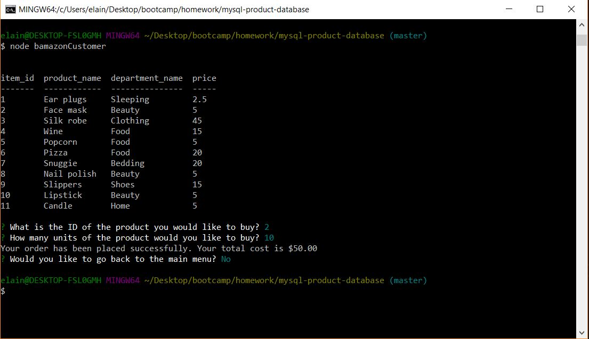
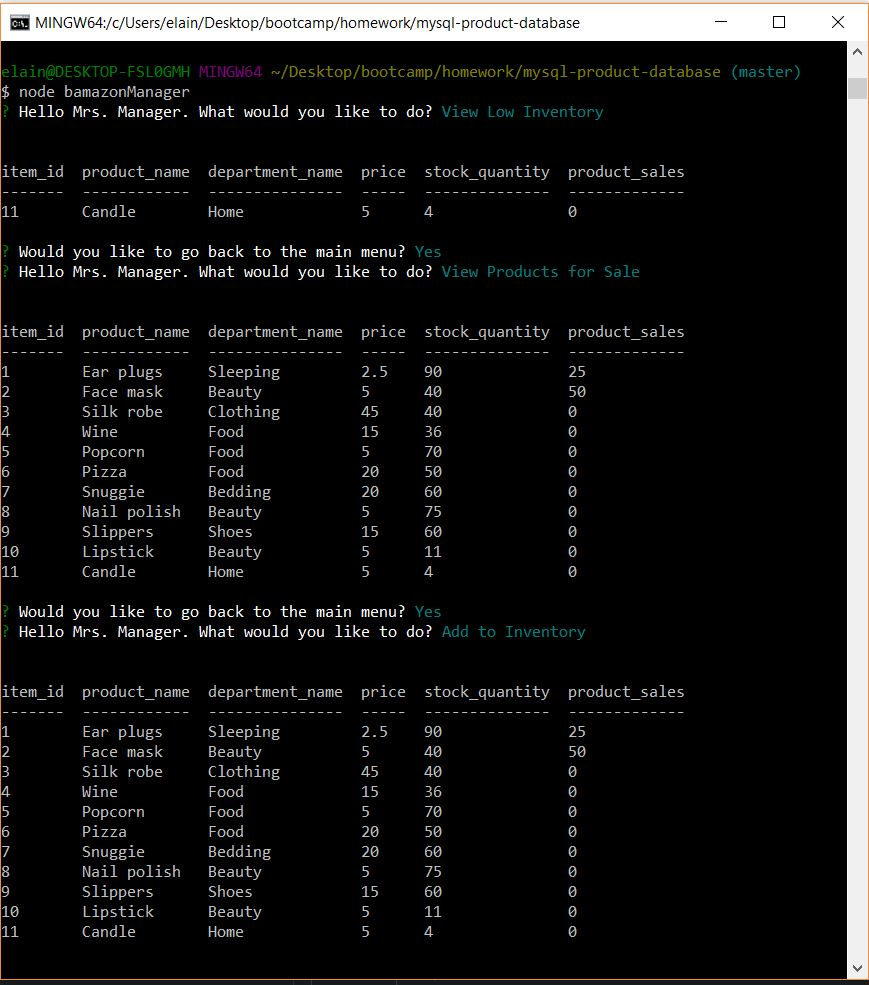
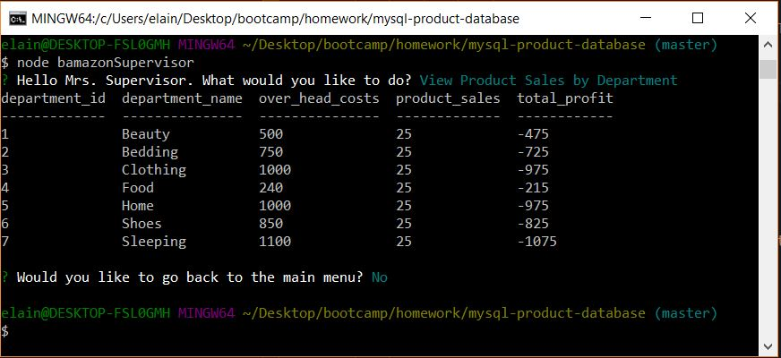

# Bamazon Store Front

An Amazon-like storefront using MySQL that will take in orders from customers and deplete stock from the store's inventory. This app can also track product sales across the store's departments and provide a summary of the highest-grossing departments in the store.

## Getting Started

- Clone repo.
- Run command in Terminal or Gitbash 'npm install'
- Run command depending which mode you would like to be on:
    * Customer - 'node bamazonCustomer'
    * Manager - 'node bamazonManager'
    * Supervisor - 'node bamazonSupervisor'
- Run 'ctrl + c' to exit each mode

### What Each JavaScript Does

1. `bamazonCustomer.js`



    * Prints all products available in the store.

    * Prompts customer which product they would like to purchase by ID number.

    * Asks for the quantity.

      * If there is a sufficient amount of the product in stock, it will return the total for that purchase.
      * However, if there is not enough of the product in stock, it will tell the user that the quantity requested is insufficient.
      * If the purchase goes through, it updates the stock quantity to reflect the purchase.
      * It will also update the product sales in the department table.

-----------------------

2. `bamazonManager.js`



    * Starts with a menu:
        * View Products for Sale
        * View Low Inventory
        * Add to Inventory
        * Add New Product

    * If the manager selects `View Products for Sale`, it lists all of the products in the store including quantity and sales.

    * If the manager selects `View Low Inventory`, it'll list all the products with less than five items.

    * If the manager selects `Add to Inventory`, it allows the manager to select a product and add inventory.

    * If the manager selects `Add New Product`, it allows the manager to add a new product to the store.

-----------------------

1. `bamazonSupervisor.js`



    * Starts with a menu:
        * View Product Sales by Department
        * Create New Department

    * If the supervisor selects `View Product Sales by Department`, it lists the department sales and calculates the total sales from the overhead cost and product sales.

    * If the supervisor selects `Create New Department`, it allows the supervisor to create a new department and input current overhead costs and product sales.

## Technologies used
- Node.js
- [Inquire NPM Package](https://www.npmjs.com/package/inquirer)
- [MYSQL NPM Package](https://www.npmjs.com/package/mysql)
- [Console.table NPM Package](https://www.npmjs.com/package/console.table)

### Prerequisites

```
- Node.js - [Download the latest version of Node](https://nodejs.org/en/)
- Create a MYSQL database called 'bamazon', reference bamazon.sql
```

## Built With

* Visual Studio Code
* MySQLWorkbench
* Terminal/Gitbash

## Authors

* **Elaine Hearn** - *JS/MySQL/Node.js* - [Elaine Hearn](https://github.com/luflicesh)